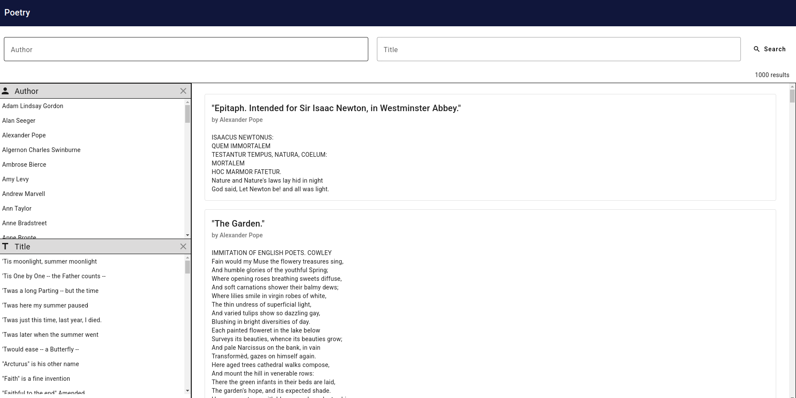

# Poetry


## Prerequisites

* Maven
* Docker
* Docker Compose
* GNU Make (optional)
* Angular CLI (optional)

## Build the app

Run the maven build, which produces a UI docker.

```
# Runs mvn clean install
make mvn
```

## Run the app

Run the docker compose app.

```
# Runs `docker-compose up -d`
make up
```

Access the UI at [http://localhost:8220](http://localhost:8220)

## UI Overview
### Initial rough sketch:


### UI screenshot after implementing the sketch:


## Deployment
The UI is packaged as a Docker container.


## Assumptions

* All data will come from the https://poetrydb.org/ api.
* UI will make REST calls to get authors and titles.
* UI will load initially with an unfiltered list of all authors and titles.
* Max results displayed: 1000
* Max poem results displayed at a time: 1
* Clicking an author is the same as typing the author in the search field and clicking search.
* Clicking a title is the same as typing the title in the search field and clicking search.
* Enter button can be pressed to initiate search from either input field (author or title).
* Selecting an author filter value should clear the title filter. I'm assuming the user wants to see all titles for the selected author.
* An error will be displayed if a 200 response is not received.
* The following characters will be sanitized from the search text, to prevent interference with the API syntax.
    - `,`
    - `/`

## Future work

- Support pagination, or a "show more" feature to get more results.
- Allow users to select max results. Currently configured to 1000.
- Could experiment with multi-selecting filter values if the API supports it.
- Allow searching text within the lines of the poems.
- When populating the filters:
  - Do a separate search that only returns title and author.
  - We could fetch a larger number filters with a smaller payload.
  - We could configure the poemcount differently for filters vs poems. For example, only show 5 actual poem results, but show all the authors in the filter panel.
